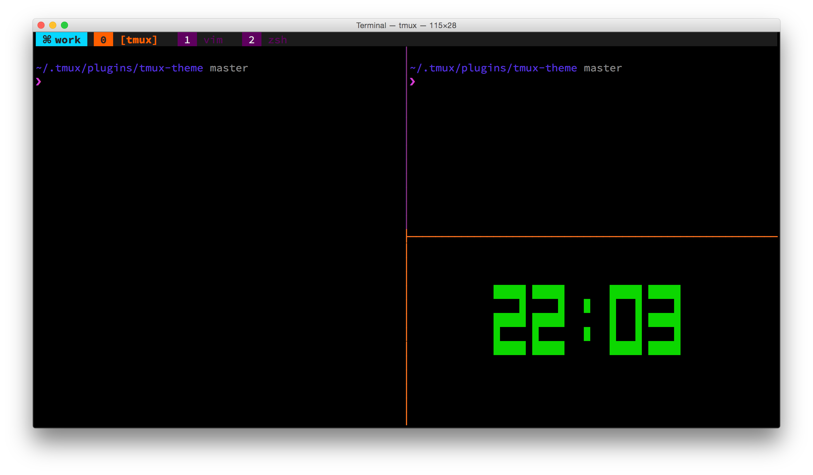

# Tmux theme

A tmux theme

## Screenshot

## Usage

[tpm](https://github.com/tmux-plugins/tpm) is recommended. Put this at the bottom of your `.tmux.conf`:

~~~ bash
# List of plugins
set -g @tpm_plugins '              \
  tmux-plugins/tpm                 \
  hanjianwei/tmux-theme            \
'
# Initializes TMUX plugin manager.
# Keep this line at the very bottom of tmux.conf.
run-shell '~/.tmux/plugins/tpm/tpm'
~~~
